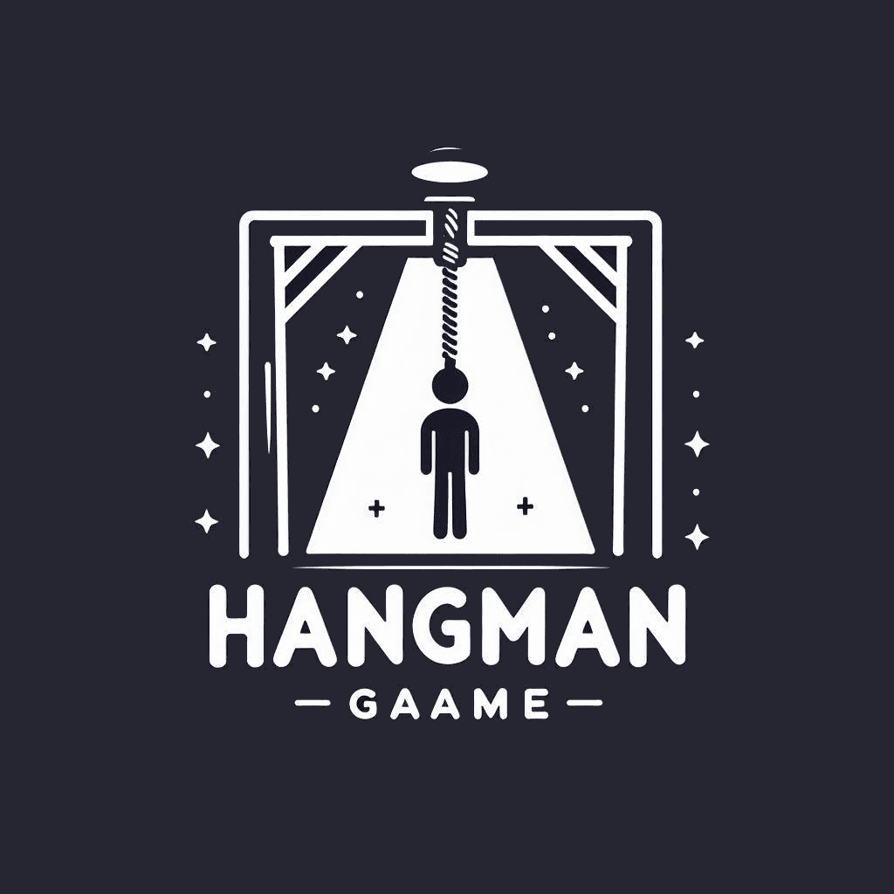
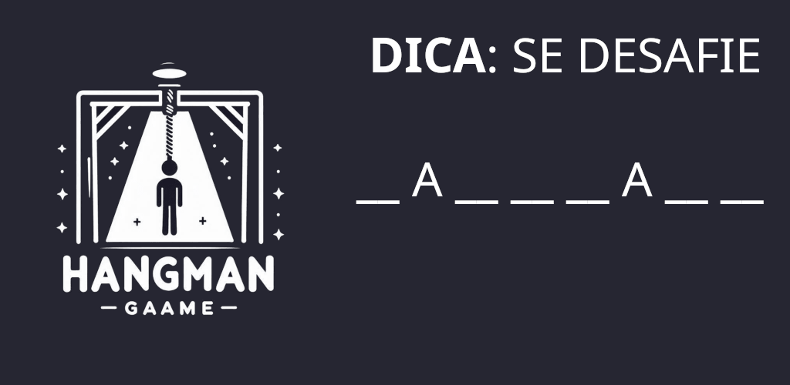
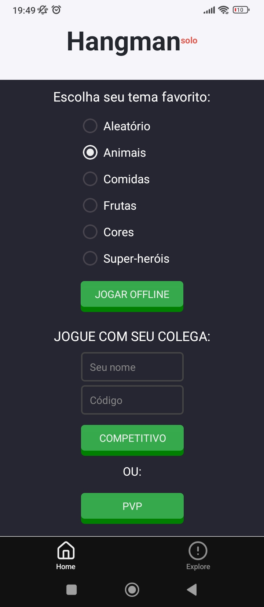
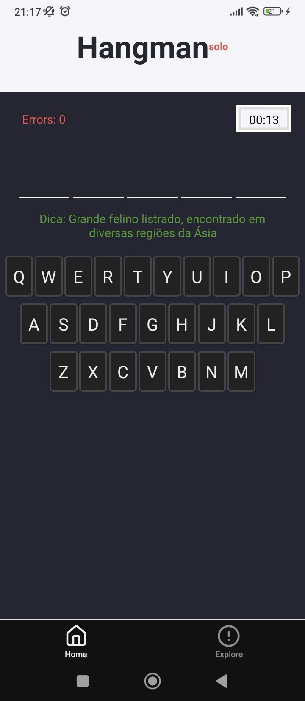
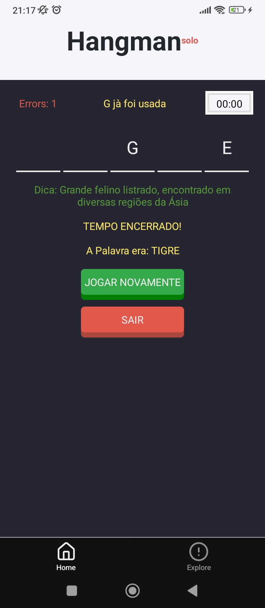
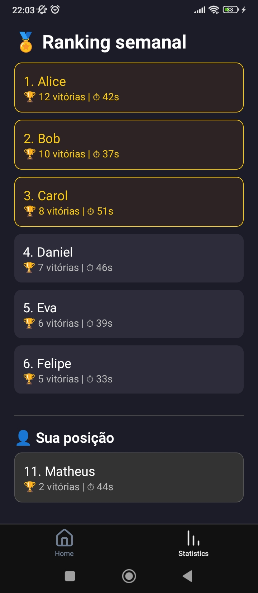

# Hangman (app)



## Recurso gráficos


## Capturas de telas do telefone
<p align="center">
  
  
  
  
</p>

## Get started

1. Install dependencies

   ```bash
   npm install
   ```

2. Start the app

   ```bash
   # Exportado
   npx eas build --profile development --platform android
   npx expo start --dev-client --tunnel

   # ou
   npx expo start --tunnel
   ```

In the output, you'll find options to open the app in a

- [development build](https://docs.expo.dev/develop/development-builds/introduction/)
- [Android emulator](https://docs.expo.dev/workflow/android-studio-emulator/)
- [iOS simulator](https://docs.expo.dev/workflow/ios-simulator/)
- [Expo Go](https://expo.dev/go), a limited sandbox for trying out app development with Expo

You can start developing by editing the files inside the **app** directory. This project uses [file-based routing](https://docs.expo.dev/router/introduction).

## Get a fresh project

When you're ready, run:

```bash
npm run reset-project
```

This command will move the starter code to the **app-example** directory and create a blank **app** directory where you can start developing.

## Learn more - 🧠 **Hangman – O Desafio da Forca Reimaginado!**

Entre no clássico jogo da forca com uma nova roupagem! **Hangman** é uma experiência divertida e desafiadora de adivinhação de palavras, perfeita para treinar sua mente e vocabulário enquanto se diverte.

Você pode jogar **sozinho no modo offline**, tentando descobrir a palavra antes que o tempo acabe — ou seus erros sejam demais. Cada acerto te recompensa com tempo extra, e cada erro te aproxima do fim!

🔤 Letras já usadas são marcadas, e dicas ajudam você a escapar do enforcamento.
⏱️ O tempo é seu inimigo… mas também sua motivação!
🏆 Ganhe partidas e entre no **ranking semanal**, mesmo que não esteja entre os melhores — sua posição é sempre mostrada.

---

### 🎮 Modos de jogo:

* **Modo Solo**: desafie o tempo e sua memória.
* (modo online em desenvolvimento)

---

### 💡 Destaques:

* Interface bonita, com teclado QWERTY otimizado
* Ranking semanal com tempo médio e número de vitórias
* Jogabilidade rápida, ideal para sessões curtas
* Leve, offline e gratuito!

---

📲 Ideal para todos os públicos — desde fãs de palavras até quem só quer matar o tédio com estilo.
